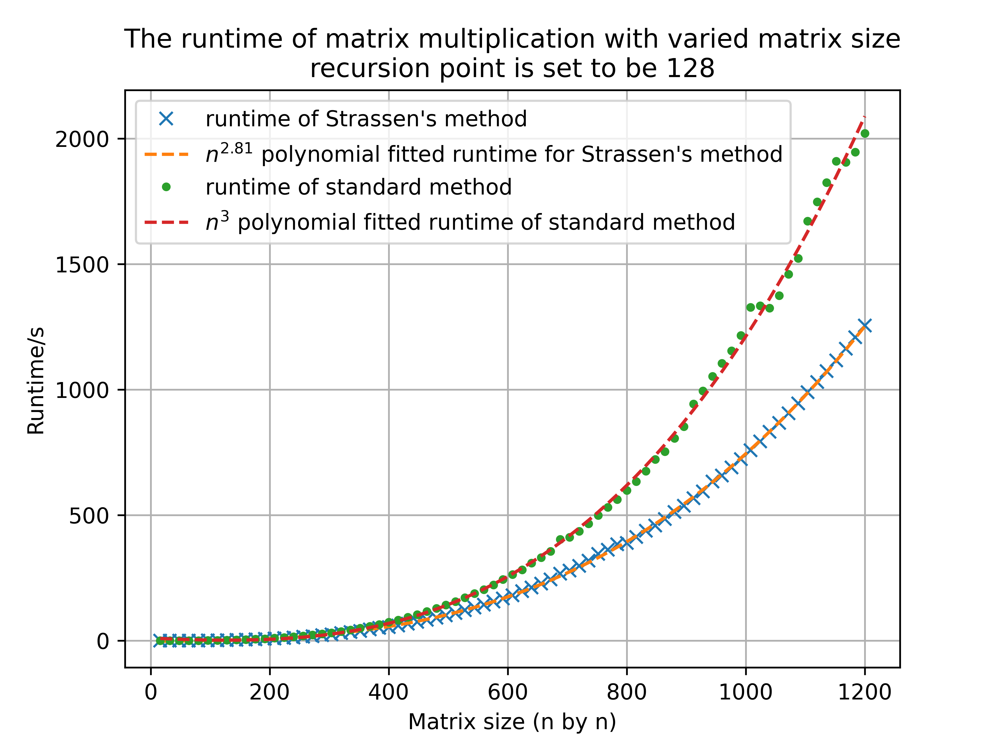
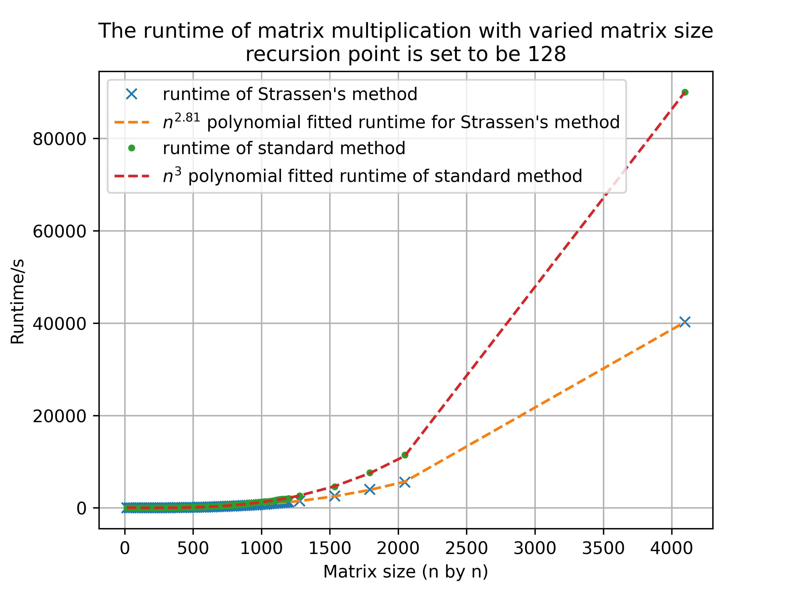
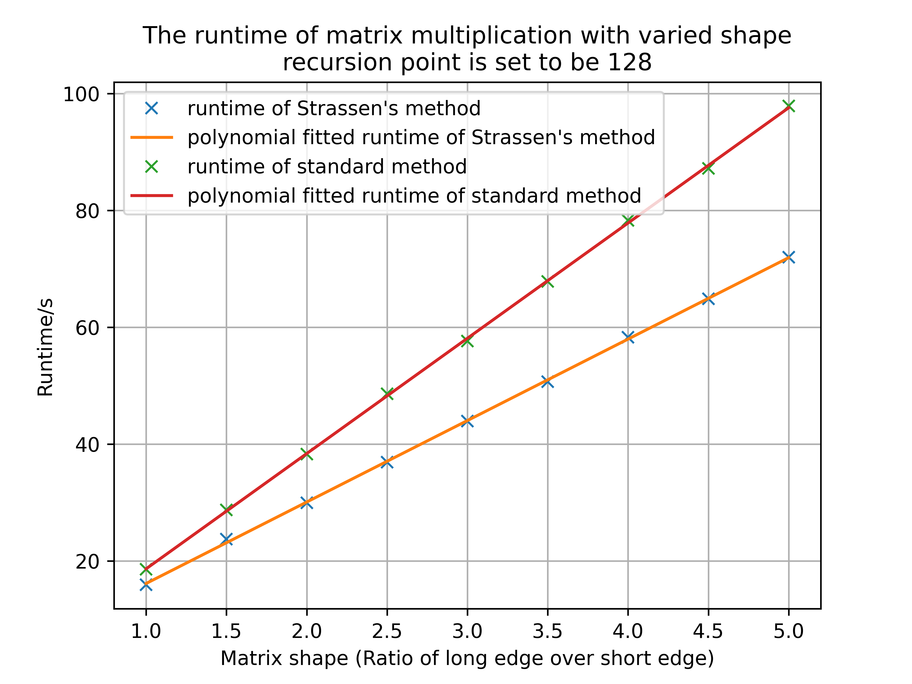
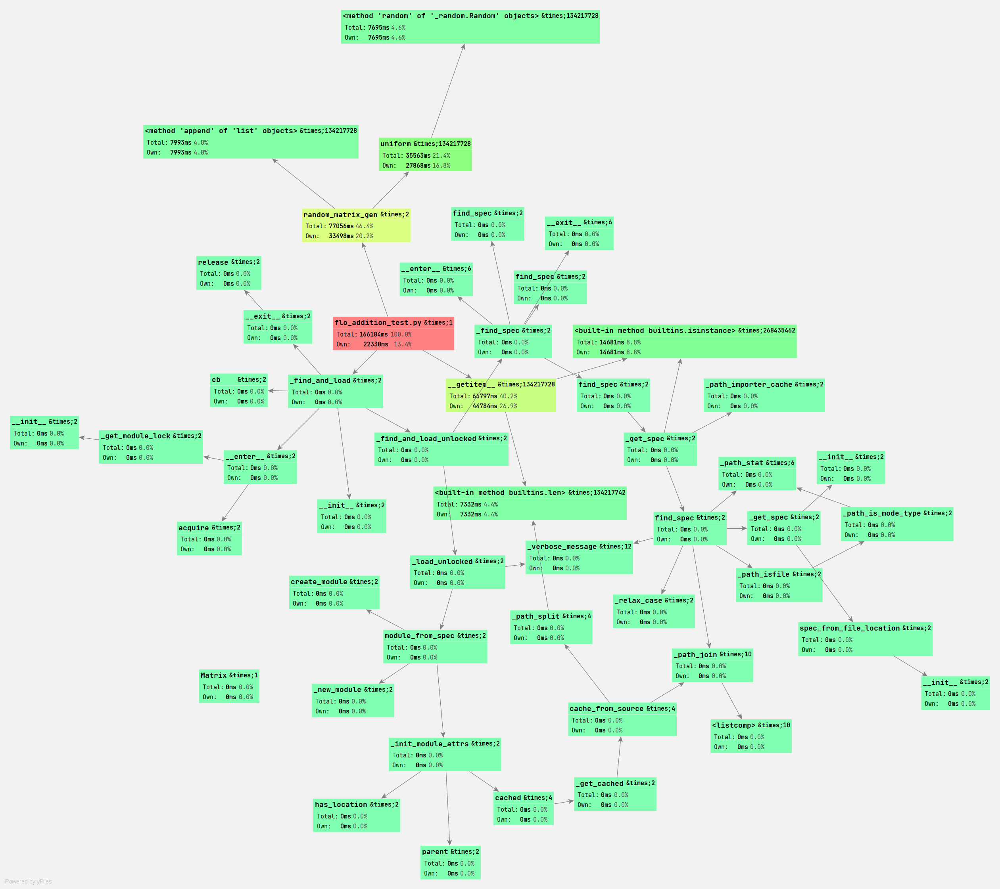
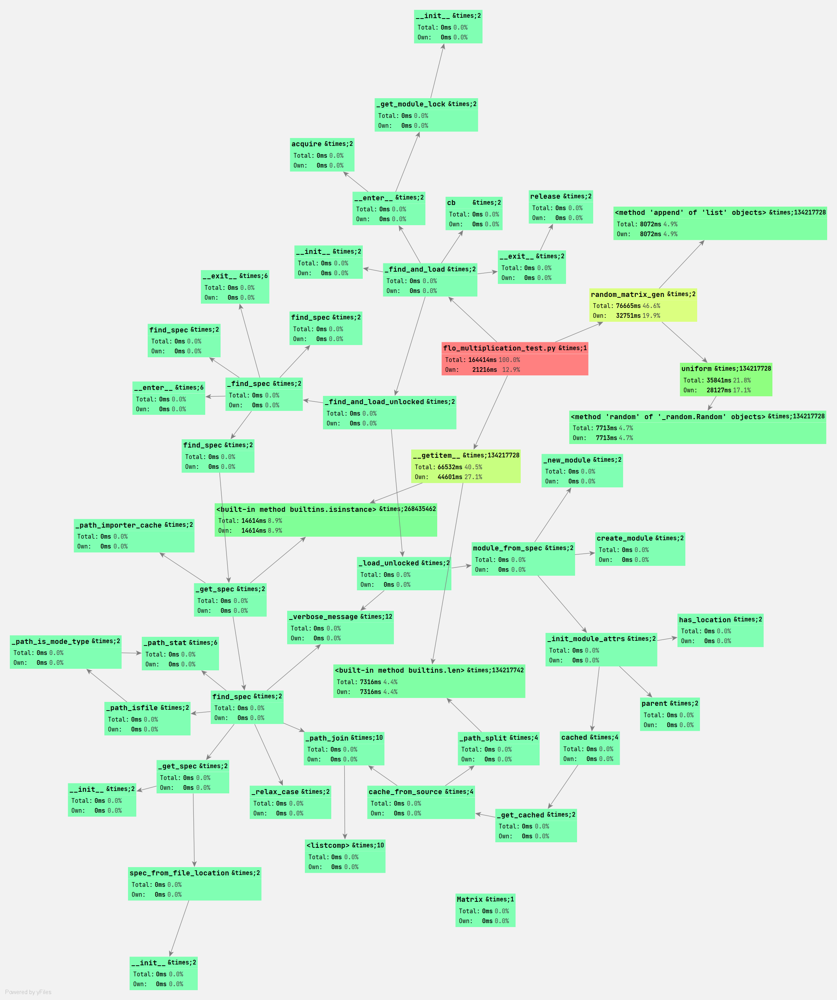
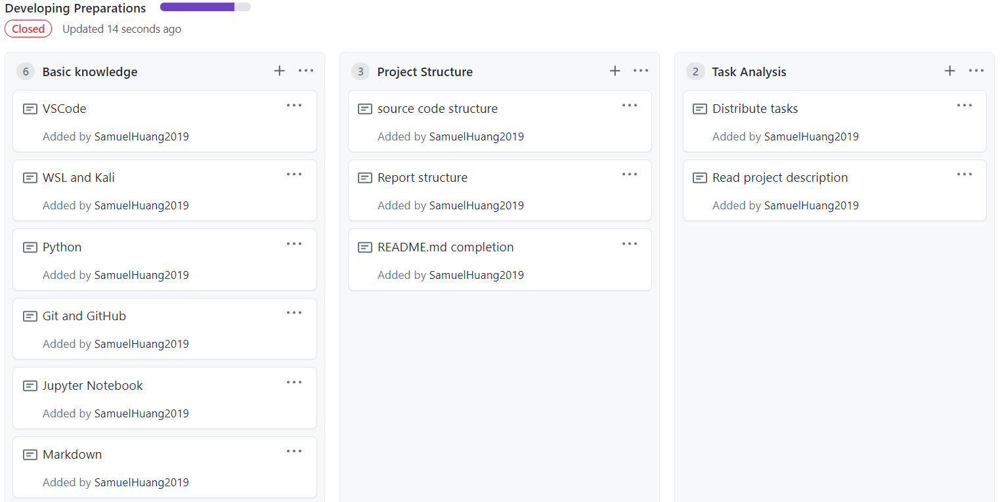

# DSAA Project Report of Group 2

This is the report for the project of DSAA course, written by Group 2, with following members.

- HUANG Guanchao, SID 11912309 from SME
- ZHENG Shuhan, SID 11712401 from PHY
- LI Yuru, SID 11911035 from EIE
- TIAN Yuqiong, SID 11911039 from EIE

The complete resources of our work in this project, including Python source codes, testing scripts, experiment raw data, figures and report can be retrieved at [our GitHub repo](https://github.com/SamuelHuang2019/dsaa-project-matrix)

[toc]

---

## Introduction

Matrix mltiplication (MM) is a practical application of Linear Algebra. It is used in many fields, including mathematics, physics and electrical engineering (**Cite**). In real life, no matter calculating the path between two place or solving the profit problem of goods, it always be of great use.

Previously, people used traditional matrix multiplication, which was based on the definition of MM, to calculate the product of two matrices. It's pseudocode is

```python
SQUARE-MATRIX-MULTIPLY(A, B)
    n = A.rows
    let C be a new n * n matrix
    for i = 1 to n
        for j = 1 to n
            Cij = 0
            for k = 1 to n
                Cij = Cij + aik * bkj
    return C
```

According to the pseudocode, the algorithm contains three circulations. Concretely, $C_{ij}=A_{ik}B_{kj}$, each index ($i,j,k$) runs from 1 to $n$. Therefore, the time complexity is $\Theta(n^3)$, where $n$ is the length of the square matrix. The time complexity of traditional method is large. Hence, since the extensive application of MM, how to optimize the operation of MM becomes more and more important. Without considering the degree of matrix density, how to effectively reduce the number of use of the arithmetic multiplication in MM is a major optimized direction.

The earliest MM optimized algorithm was proposed by German mathematician Volker Strassen in 1969 and was named Strassen algorithm (**Cite**). It's main idea is to replace multiplication by addition and subtraction. The answer is calculated by piecing some indirect terms together and using the addition and subtraction on these indirect terms to cancel out part of the terms.The pseudocode of Strassen's algorithm is

```python
Strassen(A, B)
    n = A.row
    Let C be a new matrix
    if n == 1 to n
        c11 = a11b11
    else partition A,B and C 
    P1 = Strassen(A11,B12-B22)
    P2 = Strassen(A11+A12,B22)
    P3 = Strassen(A21+A22,B11)
    P4 = Strassen(A22,B21-B11)
    P5 = Strassen(A11+A22,B11+B22)
    P6 = Strassen(A12-A22,B21+B22)
    P7 = Strassen(A11-A21,B11+B12)
    C11 = P5 + P4 - P2 + P6
    C12 = P1 + P2
    C21 = P3 + P4
    C22 = P5 + P1 - P3 - P7
    return C
```
<!-- TODO: remove pseudocode from intro -->

For Strassen algorithm, the time complexity is O(n^(\lg7)). For a two order matrix multiplication, we need to spend 8*(2^3) with Obvious matrix multiplication algorithm but we just need 7*(2^(\lg7)) by using Strassen's algorithm. The time complexity is decreased. But the space complexity of Strassen algorithm may be increased since the more spaces are needed to save the submatrix.

After Strassen came up with this algorithm, more and more optimized algorithms were proposed by different people (**Cite**). But in this project, we will focus on the Strassen algorithm. We will apply it to higher order matrix multiplication and discuss more details about it.

---

## Background

<!--
A 1-page summary of the contributions of the paper in [1]. Discuss why the authors of [1] think the topic of their paper is useful, a summary of the implementation of the adaptive method (how does it work?), and their experiment design and results. Also include some examples or particular situations where you think their results could be useful for the scientific community or industry.
-->

<!-- TODO -->
### Usefulness of Adaptive Strassen's Algorithm

The writers of the provided paper, Paolo D'Alberto and Alexandru Nicolau talked about an easy-to-use adaptive algorithm which combines a novel implementation of Strassen's idea with matrix multiplication from different systems like ATLAS. The Strassen's algorithm has decreased the running time of matrix multiplication significantly, by replacing one discrete matrix multiplication with several matrix additions. However, for modern architectures with complex memory hierarchies, the matrix additions have a limited in-cache data reuse and thus poor memory-hierarchy utilization.

The first benefit writers listed is their algorithm divides the MM problems into a set of balanced sub-problems without any matrix padding or peelingIn addition;Second, their algorithm applies Strassen’s strategy recursively as many time as a function of the problem size.Third, they store matrices in standard row or column major format so that they can yield control to a highly tuned matrix multiplication. The writers' algorithm applies to any size and shape matrices. These are the advantages of adaptive algorithm provided by the writers of the given paper.

---

### Implementation of the Adaptive Method

The concrete implementation of the adaptive algorithm is realized by several steps. To begin with, writers declared several notations and computations. As the writer suggests, their algorithm reduces the number of passes as well as the number of computations because of a balanced division process.

For matrix $C=A×B$, where $\sigma(A) = m\times n$, decompose $A$ to four small matrices $A_0$, $A_1$, $A_2$ and $A_3$. The size of four small matrices are

$$
\begin{cases}
\sigma(A_0) = \lceil m/2 \rceil\times\lceil n/2 \rceil \\
\sigma(A_{1}) = \lceil m/2 \rceil\times\lfloor n/2 \rfloor \\
\sigma(A_{2}) = \lfloor m/2 \rfloor\times\lceil n/2 \rceil \\
\sigma(A_{3}) = \lfloor m/2 \rfloor\times\lfloor n/2 \rfloor
\end{cases}
$$

The dimension is the same with matrix $B$. When we do matrix addition, we expand the scope of matrix addition to different sizes. For example, we define matrix $X = Y + Z$, if the size of $Y$ and $Z$ is not the same, then we expand the size of $X$ to the largest of them and the redundant part of $X$ is set 0. After that, the adaptive algorithm begin. Several matrix additions and multiplications is performed and are put into practice to several systems. Through this process, the writers found that the same algorithm applied to different systems can have different results.

---

### Experiment Design and Results

In conclusion, the adaptive algorithm is based on the Strassen method and have some advanced operations. The Strassen method has its run-time advantage when the matrix size is quite big, but this edge cannot be exhibited when the size is not big enough, because it add quite a lot matrix additions compared to the old standard matrix multiplication. For instance, the size has to be bigger than about 1000*1000 when Strassen method begin to show its superiority. However,  speedups up to 30% are observed over already tuned MM using this hybrid approach.

---

### Possible Applications

Their algorithm can be useful in some real-world problems involving matrix multiplication, especially for those matrix which size is big and  not fixed. For practical application, this algorithm can be applied to many industrial problems. For instance, the circuits equations which include several unknown parameters can be solved quickly by using matrix divisions, which means matrix multiplications as well. What's more, the signal processing can make good use of the algorithm, too. The input and output signals' relationship can be expressed in matrix, too. With the advantage of changeable size and comparatively fast speed, the adaptive method has great potential in real-world problems.

---

## Theoretical Analysis

<!--
Uses an abstract model to estimate the crossover point analytically. You can provide this based on a review of academic papers and the textbook but make sure you explain it clearly and discuss the structure, constants, assumptions, and limitations of the theoretical model.
-->

### Time Complexity of Standard Matrix Multiplication

From the pseudocode we can know that there are three for-loop cycles so that the time complexity for Standard matrix multiplication is $\Theta(n^3)$.

---

### Time Complexity of Strassen Algorithm

From the recurrence relationship we know that the run-time complexity is $T(n)=7T(n/2)$+ $\Theta(n^2)$(when n>1). By the master method, the run-time complexity for Strassen algorithm is $\Theta(n^lg7)$.

---

### Crossover Point Estimation

 The crossover point means the size of matrix when the run-time of Strassen algorithm is faster than the Standard Matrix multiplication.
 From the time complexity we know that the Strassen method is faster than the standard matrix multiplication, however, in practice for small matrices, Strassen's method has a significant overhead and conventional MM results in better performance. To overcome this, several authors mentioned in the provided paper have shown hybrid algorithms, by deploying Strassen's method in conjunction with conventional matrix multiplication. For our project, we explored the crossover point in practical ways, running the python code for both Strassen method and standard matrix multiplication. The concrete result is given in the empirical analysis, and is explained in different illustrations.

<!-- TODO -->

---

## Methodology

<!-- in which you explain Strassen Algorithm, standard matrix multiplication and give pseudocode and further explanation. Include your runtime analysis from Part 2 here. -->

<!-- TODO -->

### Strassen Algorithm

Comparing to the Obvious matrix multiplication, the Strassen's Algorithm replaces matrix multiplication into the matrix addition. In this algorithm, the operated matrices are divided into some submatrices and define some other submatrices to be the basic operated matrices which are calculated by the addition or subtraction of those submatrices which are divided from the operated matrices. Then repeat these procedures on all submatrices and get the resulting submatrices which we define as "P". Then get the submatrices of the product of the original operated matries. Finally add all these submatrices to get the result.
Since the Strassen's Algorithm replaces the one separated matrix multiplication with several new matrix additions. It can significantly reduce the running time of matrix multiplication lower. The pseudocode for Strassen's method used in two-ordered matrix can be written as follows:

```python
Strassen(A, B)
    S1 = B12 - B22
    S2 = A11 - A12
    S3 = A21 + A22
    S4 = B21 - B11
    S5 = A11 + A22
    S6 = B11 + B22
    S7 = A12 - A22
    S8 = B21 + B22
    S9 = A11 - A21
    S10 = B11 + B12
    P1 = Strassen(A11, S1)
    P2 = Strassen(A11, B22)
    P3 = Strassen(S3, B11)
    P4 = Strassen(A22, S4)
    P5 = Strassen(S5, S6)
    P6 = Strassen(S7, S8)
    P7 = Strassen(S9, S10)
    C11 = P5 + P4 - P2 + P6
    C12 = P1 + P2
    C21 = P3 + P4
    C22 = P5 + P1 - P3 - P7
    return C
```

For n-ordered matrix multiplication, the pseudocode of Strassen's algorithm is :

```python
Strassen(A, B)
    n = A.row
    Let C be a new matrix
    if n == 1 to n
        c11 = a11b11
    else partition A, B and C 
        P1 = Strassen(A11,B12-B22)
        P2 = Strassen(A11 + A12, B22)
        P3 = Strassen(A21 + A22, B11)
        P4 = Strassen(A22, B21 - B11)
        P5 = Strassen(A11 + A22, B11 + B22)
        P6 = Strassen(A12 - A22, B21 + B22)
        P7 = Strassen(A11 - A21, B11 + B12)
        C11 = P5 + P4 - P2 + P6
        C12 = P1 + P2
        C21 = P3 + P4
        C22 = P5 + P1 - P3 - P7
    return C
```

According to the recurrence relation, the running time for Strassens method is $T(n) = 7T(n/2) + \Theta(n^2)$. When $n$ is very large, the time is significantly lower than the standard matrix multiplication.

---

### Standard Matrix Multiplication

For the standard matrix multiplication, the running time is about n^3, and the pseudocode is given below:

```python
SQUARE-MATRIX-MULTIPLY(A, B)
    n = A.rows
    let C be a new n * n matrix
    for i = 1 to n
        for j = 1 to n
            Cij = 0
            for k = 1 to n
                Cij = Cij + aik * bkj
    return C
```

---

## Experiment Design

<!-- describes your implementation of the two algorithms and the way you generate test problems (ie matrices to multiply). -->

<!-- TODO -->

---

### Class `Matrix`

A data structure for matrix. The matrix implementation is suitable for dense matrices. A class `Matrix` is defined in the implementation.  
This class `Matrix` represent a matrix in row-major order (i.e. for an n×n-matrix the first row will be stored in an array at index 0 to index n-1 the
next row at n to 2n-1 and so on). The class provides a constructor and methods to get and set the element at any row column index.

**Attributes**:

```
    row: int, default 1  
    col: int, default 1  
    elements: list, default [0.0]
```

**Methods**：

```
    __init__(self, elements, row=None, col=None):
        # Generate a Matrix object.

    __str__(self):
        # Return a row*col matrix-like string.
        
    __getitem__(self, item):
        # Return elements in a Matrix object.
        
    __add__(self, other):
        # If other is a matrix, perform matrix addition, else perform addition with a number element-wisely.
        # Return a Matrix object
    
    __sub__(self, other):
        # If other is a matrix, perform matrix subtraction, else perform subtraction with a number element-wisely
        # Return a Matrix object

    __sizeof__(self):
        # Return the number of elements in a Matrix object.
        
    dimension(self):
        # Return row and col numbers of a Matrix object.
```

#### Data Storage

Matrix elements are stored in a list following row-major order.  
For instance, a 2 by 2 matrix $a$ is stored as a list \[$a_{11} a_{12} a_{21} a_{22}$\].

#### Indexing

The index rule of an element in a `Matrix` object follows conventions in math.  
That is, Matrix\[i, j\] is the element in the ith row and jth column (i and j run from 1 to Matrix.row and Matrix.col respectively).

---

### Other Operations

#### Function `adaptive_add()` and `adaptive_minus()`

adaptive_add(a, b, target_row, target_col):  
    Given target matrix size, perform matrix addition of Matrix a and b.  
    The function is called by `strassen_matrix_multiply()`.  
    Return a `Matrix` object with the size of `target_row`*`target_col`.

adaptive_minus(a, b, target_row, target_col):  
    Given target matrix size, perform matrix subtraction of `Matrix` a and b.  
    The function is called by `strassen_matrix_multiply()`.  
    Return a `Matrix` object with the size of target_row*target_col.

The following is the code of `adaptive_add(a, b, target_row, target_col)`. The code of `adaptive_minus(a,...)` is similar.

```python
def adaptive_add(a, b, target_row, target_col):
    """
    Given target matrix size, perform adaptive matrix addition
    :type a: Matrix 
    :type b: Matrix
    :type target_col: Integer
    :type target_row: Integer
    :return: Matrix
    """  
    arow = a.row
    acol = a.col
    brow = b.row  
    bcol = b.col
    s = [0] * (target_col * target_row)
    for i in range(target_row): 
        for j in range(target_col):
            flag = False
            if 0 <= i < arow and 0 <= j < acol:
                s[i * target_col + j] = a[i + 1, j + 1]
                flag = True
            if 0 <= i < brow and 0 <= j < bcol:
                s[i * target_col + j] = s[i * target_col + j] + b[i + 1, j + 1]
                flag = True
            if not flag:
                s[i * target_col + j] = 0
    c = Matrix(s, target_row, target_col)   
    return c
```

#### Function `square_matrix_multiply()`

square_matrix_multiply(a, b):  
    Given `Matrix` a and b, perform standard matrix multiplication. `a.col` must equal to `b.row`.  
    Return a `Matrix` object.

#### Function `strassen_multiply()`

strassen_multiply(a, b, n=None):  
    Given `Matrix` a and b, perform an improved version of Strassen's algorithm.  
    The `adaptive_add()` and `adaptive_minus()` are called in `strassen_multiply()` to tackle arbitrary matrix size inputs.  
    The algorithm is based on the paper published by Paolo D’Alberto and Alexandru Nicolau in 2007.  
    Return a `Matrix` object.

#### Function `random_matrix_gen()`

This function is for generating matrices for testing.

```python
def random_matrix_gen(n):
    """
    Generates a random matrix of size n by n, the elements are randomly from -1 to 1 float number.
    :param n: the size of the matrix
    :type n: int
    :return: The generated random matrix
    :rtype Matrix
    """
    elements = []
    for i in range(n * n):
        elements.append(random.uniform(-1, 1))
    return Matrix(elements, n, n)
```

---

## Empirical Analysis

<!-- provides your results of parts 3 and 4 evaluating the adaptive method for matrix multiplication, Strassen’s algorithm, and the basic method. You should use [1] as an example of the type of results you should put in this section (tables, graphs, type of discussion) because when marking will expect to see graphs and results that are of comparable quality to this and measure similar quantities. -->

---

### Testing Platform

The specifications of our main testing platform is as follows:

- Hardware
  - AMD Ryzen 9 3900X, with 12 cores, 24 threads, running at 3.8GHz, **maximum turbo frequency 4.6GHz**
  - ADATA DDR4 3200MHz 16GB × 4, **running at 2666MHz**, quad channel
  - Gigabyte X570 Gaming X
- Software
  - Windows 10 Professional 20H2
  - Python 3.9.1
  - PyCharm 2020.3, Professional Edition
  - Visual Studio Community 2019

>Special thanks to SUN Jiachen, for providing us with this powerful testing platform.

<!-- TODO: add platform info -->

Some other lightweight tests are conducted on our own platform Surface Pro 6, the specifications are shown below.

- Hardware
  - Microsoft Surface Pro 6 1796
  - Intel Core i7-8650U, with 4 cores, 8 threads, 1.99GHz, running at 2.11GHz, **maximum Turbo frequency 4.2GHz**
  - 8GB of RAM, dual channel, **running at 1867MHz**
- Software
  - Windows 10 Professional 20H2
  - WSL2, Kali Linux
  - Python 3.9.1, running in WSL2
  - PyCharm 2020.3 Professional Edition
  - Visual Studio Code, with Pylance engine
  - Visual Studio Community 2019

---

### Performance Benchmark

<!-- TODO: merge redundancy -->

According to Paolo D'Alberto and Alexandru Nicolau, the crossover point (or the recursion point) for square matrices case is expressed as

$$
n_1 = \frac{\alpha}{\pi}.
$$

Therefore, it is natural for us to try to find this ratio by running benchmark, in order to approximate the recursion point. To simulate the real floating point addition and multiplication in MM, we conducted this benchmark by initializing two matrices, and do addition and multiplication by indexing the elements in the matrices.

```python
import time
from Matrix import random_matrix_gen

n = 8192
m1 = random_matrix_gen(n)
m2 = random_matrix_gen(n)

time1 = time.time()
for i in range(n * n):
    s = m1[i] + m2[i]
time2 = time.time()
print(time2 - time1)
```

Similarly, the test for multiplication is written in another module, so that we can utilize analyzer provided by Visual Studio or PyCharm to evaluate the performance.

Firstly, we run the performance benchmark, to figure out the run time of `float` addition and `float` multiplication.

We tested the additions and multiplications between the elements of two matrices of size 8192 by 8192, in total $2^{26}$ floating point numbers, the total runtime of which is shown below.

|     Addition      |  Multiplication   | Ratio $\alpha/\pi$ |
| :---------------: | :---------------: | :----------------: |
| 89.12498784065247 | 87.74823570251465 | 0.984552568572583  |

Which is obviously an absurd result, since generally, the runtime for addition cannot be longer than multiplication. In this case, the ratio is of sheds no light on the estimation of crossover point.

In this experiment, the larger size of the matrices is, the more convincing the result is. However, too large matrices would lead to unacceptable runtime for a single test. After doing several brief test on multiplication of different matrices size, taking the pace of our work into consideration, we chose 512 by 512 matrices for finding the crossover point.

---

### Crossover Point Searching

For searching for the crossover point, we used `openpyxl` package to collect the data in Excel file. In the script, `n` is the matrix size we consider, `s` is the start point for searching, `e` is accordingly the end point, `r` means for each recursion point, tests are conducted twice and take average.

```python
from Matrix import *
import time
import openpyxl

n = 512
s = 1
e = 64
r = 2

print("Matrix generation starts")
m1 = random_matrix_gen(n)
print("Matrix 1 generated")
m2 = random_matrix_gen(n)
print("Matrix 2 generated")

wb = openpyxl.load_workbook('../analysis/data.xlsx')
print("workbook", wb.sheetnames, "loaded")
ws = wb['crossover_point']

for i in range(s, e + 1):
    strassen = 0
    square = 0
    ws['A' + str(i)] = i
    print("The recursion point is set to be ", i)

    for j in range(1, r + 1):
        print("test ", j)

        time1 = time.time()
        c = strassen_multiply(m1, m2, i)
        time2 = time.time()
        print("The run time of Strassen's method is", time2 - time1)
        strassen = time2 - time1 + strassen

        time1 = time.time()
        c1 = square_matrix_multiply(m1, m2)
        time2 = time.time()
        print("The run time of brutal method is", time2 - time1)
        square = time2 - time1 + square

    print("average strassen", strassen / r)
    ws['B' + str(i)] = strassen / r
    print("average square", square / r)
    ws['C' + str(i)] = square / r
    print("==========")

wb.save('../analysis/data.xlsx')
```

To make the condition as close as possible, `square_matrix_multiply()` is executed again every time `strassen_matrix_multiply()` runs in the loop, even theoretically the recursion point has no affect on the run time of `square_matrix_multiply()`.

The plot of the runtime with respect to the selection of recursion point is shown below.


From the figure, it is clear that, for 512 by 512 matrix multiplication, Strassen's method is stably faster then the standard method for about 40 seconds, even if the recursion point is set to be 1. In general, though the runtime of the two methods has fluctuations, but the tendency is synchronous, hence we may consider these changes as a consequence of the load of the computer and operating system.

More intuitively, the plot of the difference is shown below.


In which the difference percentage is defined as

$$
\text{difference percentage} =
\frac{\text{runtime of standard method} - \text{runtime of Strassen's method}}
{\text{runtime of standard method}}
$$

No obvious regular pattern could be found from the statistics. Therefore, the affect on the runtime of the Strassen's multiplication due to the choice of recursion point can be neglected.

---

### Algorithm Performance

#### For Varied Matrix Size

The runtime of Strassen's multiplication and its $n^{2.81}$ polynomial fitted graph, along with that of standard matrix multiplication graph is shown below.



In this figure, the runtime of our Strassen's multiplication can be perfectly fitted with

$$
T =
3.0306\times10^{-6}n^{2.81} -
0.0001 n^2 +
0.0333 n -
2.7749.
$$

The runtime of our standard matrix multiplication can be perfectly fitted with

$$
T =
1.1190\times10^{-6}n^3 +
1.9060\times10^{-4}n^2 -
1.0860\times10^{-1}n +
1.0460.
$$

Adding a small amount of results from larger matrices, the conclusion is still roughly consistent.



These results perfectly corresponds to the asymptotic estimation of time complexity in theoretical analysis.

#### For Varied Matrix Shape

Though adaptive Strassen's method, it should work best with square or almost square matrices. We also conducted a test for the performance of adaptive Strassen's method with varied matrix size.

In this experiment, the dimension of the matrices is from 256 by 256 to 256 by 1280, hence the ratio of the long edge over the short edge is from 1 to 5. The results are shown below.



From the figure, it is clear that, the runtime of MM in two methods increases linearly as oen dimension of the matrix grows. However, the runtime of adaptive Strassen's method grows even slower. This contradicts our assumption.

---

### More on FLO Benchmark

The results obtained from FLO benchmark is completely invalid, hence we did further research on it. The profiler tool in PyCharm enables us to analyze the CPU time and function calling tree. According to the report, most of the CPU time were spent on indexing the elements of the matrices.

#### For Addition Test

The call graph of addition test is shown below.



The most called functions are shown below (in order of time).

| Name                                            | Call Count | Time (ms) | Time percentage | Own Time (ms) | Own time percentage |
| ----------------------------------------------- | ---------: | --------: | :-------------: | ------------: | :-----------------: |
| `flo_addition_test.py`                          |          1 |    166184 |     100.0%      |         22330 |        13.4%        |
| `random_matrix_gen`                             |          2 |     77056 |      46.4%      |         33498 |        20.2%        |
| `__getitem__`                                   |  134217728 |     66797 |      40.2%      |         44784 |        26.9%        |
| `uniform`                                       |  134217728 |     35563 |      21.4%      |         27868 |        16.8%        |
| \<built-in method `builtins.isinstance`\>       |  268435462 |     14681 |      8.8%       |         14681 |        8.8%         |
| \<method `append` of `list` objects\>           |  134217728 |      7993 |      4.8%       |          7993 |        4.8%         |
| \<method `random` of `_random.Random` objects\> |  134217728 |      7695 |      4.6%       |          7695 |        4.6%         |
| \<built-in method `builtins.len`\>              |  134217742 |      7332 |      4.4%       |          7332 |        4.4%         |

>The rest calls are with negligible runtime.

#### For Multiplication Test

The call graph of multiplication test is shown below.



| Name                                            | Call Count | Time (ms) | Time percentage | Own Time (ms) | Own time percentage |
| ----------------------------------------------- | ---------: | --------: | :-------------: | ------------: | :-----------------: |
| `flo_addition_test.py`                          |          1 |    164414 |     100.0%      |         21216 |        12.9%        |
| `random_matrix_gen`                             |          2 |     76665 |      46.6%      |         32751 |        19.9%        |
| `__getitem__`                                   |  134217728 |     66532 |      40.5%      |         44601 |        27.1%        |
| `uniform`                                       |  134217728 |     35841 |      21.8%      |         28127 |        17.1%        |
| \<built-in method `builtins.isinstance`\>       |  268435462 |     14614 |      8.9%       |         14614 |        8.9%         |
| \<method `append` of `list` objects\>           |  134217728 |      8072 |      4.9%       |          8072 |        4.9%         |
| \<method `random` of `_random.Random` objects\> |  134217728 |      7713 |      4.7%       |          7713 |        4.7%         |
| \<built-in method `builtins.len`\>              |  134217742 |      7316 |      4.4%       |          7316 |        4.4%         |

>The rest calls are with negligible runtime.

#### Analysis for FLO Runtime

In the two tables above, `flo_addition_test.py` and `flo_multiplication.py` is the test script, hence takes the whole runtime. Function `random_matrix_gen` and `uniform` is for generating the random matrices. From the CProfiler statistics, we can see that, the efficiency of matrix elements addition and multiplication is nearly the same, including the detailed statistics for each function calls. The most of the runtime, that is to say, up to is 74.95% in addition and 75.82% in multiplication, setting aside the runtime of matrices generation, is spent on indexing the elements.

```python
def __getitem__(self, item):
    ...
    # for tuple input
    if isinstance(item, tuple):
        # both of the elements in the item are slice
        if isinstance(item[0], slice) and isinstance(item[1], slice):
            ...
            return Matrix(e, r, c)

        # one slice, one int
        # both of the elements in the item are int
        if isinstance(item[0], int) and isinstance(item[1], int):
            ...
            return self.elements[(item[0] - 1) * self.col + item[1] - 1]

    # else for int input
    if isinstance(item, int):
        if item > len(self.elements):
            raise (exceptions.ColumnOutOfBoundsException(item))
        return self.elements[item - 1]
```

Referring to the source code of `__getitem__` method, it is clear that, in order to support different indexing patterns, and to give a hint for users while for out of bounds exception, `isinstance` and `len` functions are called too many times.

Since the process of indexing the elements, or `__getitem__` function dominates the runtime of FLO, the efficiency advantage of floating point addition against multiplication is completely diluted. Thus, seemingly, floating point multiplication is as "fast" as addition, which is the reason why our Strassen's method is always faster than the standard matrix multiplication in spite of the choice of recursion point, even if which is set to be 1.

---

## Conclusion

### Performance Bottleneck

The performance of our algorithms is severely restricted by the data structure. More concisely, the performance bottleneck is the process of indexing the elements in matrix.

### Balance between Performance and Ease of use

The reason the indexing process, or the `__getitem__` method is inefficient, is the tedious procedure for judging the form of indexing. Such practice offers convenience for user, since more complex indexing operations, such as slice, are supported through it. However, this also caused huge performance waste.

The balance between code performance and user friendliness is of great significance. Indeed, our data structure provides prominent ease of use for developers or users, however, the performance cost is too high for the purpose of this project.

### Optimizations

Some optimizations can be made to our code to improve the performance.

- The indexing of the elements can be less flexible, instead, using more operations in underlying system, in order to provide better performance
- Some judge sentences, such as verifying the dimension of the matrices can be commented out, since this project is only intended for testing the performance of the algorithm itself.
- Multi-thread, parallel run, or even SIMD in GPU acceleration may be introduced, and provides a huge improvement in performance.

---

## Project Management and Contributions

- HUANG Guanchao, SID 11912309 from SME
  - organizing the project team, work scheduling
  - `Matrix` data structure implementing
  - conducting algorithm test
  - experiment data analysis
  - [Empirical Analysis](#empirical-analysis) and [Conclusion](#conclusion) part of report
  - creating PowerPoint slides, and delivered presentation on class
  - final adjust of the report
  - the [repository of this project](https://github.com/SamuelHuang2019/dsaa-projec-matrix) is under his GitHub account [SamuelHuang2019](https://github.com/SamuelHuang2019)

- ZHENG Shuhan, SID 11712401 from PHY
  - reading the paper, and offering theoretical instructions on adaptive Strassen's algorithm for us
  - `Matrix` data structure implementing
  - implementing two methods of multiplication, including function `square_matrix_multiply`, `adaptive_add`, `adaptive_minus` and `strassen_multiply`
  - [Code Implementation](#experiment-design) part of the report

- LI Yuru, SID 11911035 from EIE
  - [Introduction](#introduction)
-TIAN Yuqiong, SID 11911039 from EIE
 [Background](#background) and [Theoretical Analysis](#theoretical-analysis) part of the report

-

>SPECIAL THANKS TO:
>
> - SUN Jiachen, who provided testing platform for us.
> - HAN Zichen, who offered us professional advice on Python and other CS problems.

Our project is based on GitHub for version control and code cooperation, on which we created projects for different stages of our work.




Also, we opened some issues while code debugging.


Until xxx, the contributions insight is as shown below.

---

## Open Source License

Copyright (c) 2020 SamuelHuang2019

Permission is hereby granted, free of charge, to any person obtaining a copy
of this software and associated documentation files (the "Software"), to deal
in the Software without restriction, including without limitation the rights
to use, copy, modify, merge, publish, distribute, sublicense, and/or sell
copies of the Software, and to permit persons to whom the Software is
furnished to do so, subject to the following conditions:

The above copyright notice and this permission notice shall be included in all
copies or substantial portions of the Software.

THE SOFTWARE IS PROVIDED "AS IS", WITHOUT WARRANTY OF ANY KIND, EXPRESS OR
IMPLIED, INCLUDING BUT NOT LIMITED TO THE WARRANTIES OF MERCHANTABILITY,
FITNESS FOR A PARTICULAR PURPOSE AND NONINFRINGEMENT. IN NO EVENT SHALL THE
AUTHORS OR COPYRIGHT HOLDERS BE LIABLE FOR ANY CLAIM, DAMAGES OR OTHER
LIABILITY, WHETHER IN AN ACTION OF CONTRACT, TORT OR OTHERWISE, ARISING FROM,
OUT OF OR IN CONNECTION WITH THE SOFTWARE OR THE USE OR OTHER DEALINGS IN THE
SOFTWARE.
